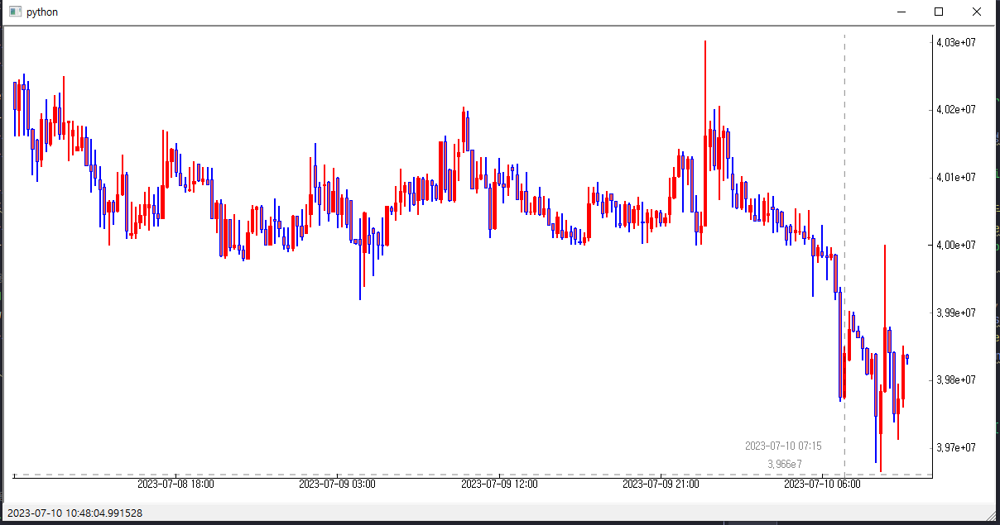
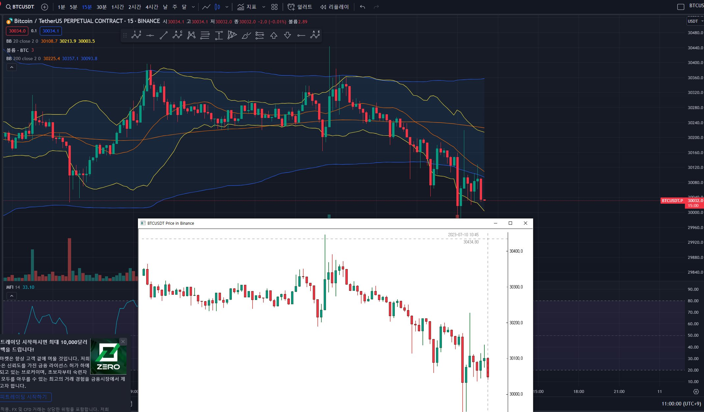

# binance_visualization
Visualizing binance price data. (making a real-time chart)

- To use PyQt5 in Raspberry Pi, you need to use the command, "sudo apt install python3-pyqt5", rather than using "pip3 install pyqt5".
- Also for matplotlib, "sudo apt install python3-matplotlib".
- And if there is any errors about importing "Numpy" Library, try "sudo apt-get install python-dev libatlas-base-dev", "sudo apt-get install libopenblas-dev"
- For qtwidgets, "pip3 install qtwidgets"
- Use pip3 and python3 to run it.
- Erase all the Korean comments
- "sudo nano /home/pi/.bashrc"  And add commands
  - echo Running at boot
  - sudo python3 file_to_run.py" (The actual code you want to run when booting)
Reference: [wikidocs.net- PyQt를 이용한 파이썬 GUI 프로그래밍](https://wikidocs.net/160261), [github.com/highfestiva](https://github.com/highfestiva/finplot/blob/master/finplot/examples/bitmex-ws.py), [stackoverflow](https://stackoverflow.com/)

